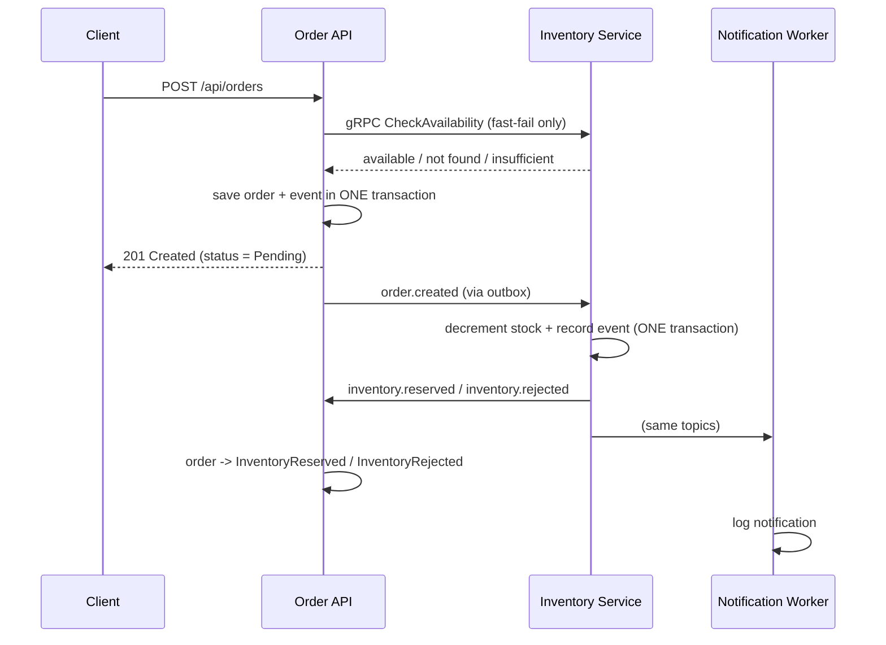

# OrderFlow

An event-driven .NET 8 order pipeline: REST API + gRPC + Kafka + PostgreSQL, running end to end under Docker Compose.

The point of the project is the **reliability plumbing** — exactly-once stock changes on top of Kafka's at-least-once delivery, no lost events, no lost updates.

---

## The flow



`201 Created` means **accepted**, not reserved. The real outcome arrives asynchronously — poll `GET /api/orders/{id}` for it.

---

## Projects

| Project | Role |
|---|---|
| `OrderFlow.Contracts` | Event records, topic names, Kafka options. One definition of the wire format. |
| `Order.Api` | REST API, order persistence, outbox + publisher, order-status consumer, gRPC client. |
| `Inventory.Service` | gRPC server (`CheckAvailability`) and the `order.created` consumer that owns the real stock decision. |
| `Notification.Worker` | Consumes both result topics and logs the notification. |

Topics: `order.created` (3 partitions), `inventory.reserved`, `inventory.rejected` — created by `kafka-init` before any app starts.

---

## Design decisions worth knowing

**Transactional outbox.** The order row and its `order.created` event are written in a single `SaveChanges`. A Kafka outage can never leave an order committed with no event. A background publisher drains the table with `FOR UPDATE SKIP LOCKED`, so multiple API instances never publish the same event twice.

**Exactly-once stock changes.** `inventory.processed_events` is keyed on `EventId` and written in the *same transaction* as the decrement. A redelivered event cannot decrement stock twice. The outcome payload is stored too, so a replay **republishes the original decision** instead of silently dropping it.

**No lost updates.** PostgreSQL's `xmin` is mapped as an optimistic concurrency token on `inventory_items`; conflicts retry inline.

**`order.created` is keyed by ProductId, not OrderId.** All orders for the same item land on one partition and are processed serially — this is what removes the race structurally rather than relying on locking.

**The gRPC pre-check is not a reservation.** It's a fast-fail for good UX. Two concurrent orders for the last unit can both pass it; one gets rejected asynchronously. The inventory consumer is the only authority on stock.

**Consumers run on dedicated long-running threads.** `IConsumer.Consume()` blocks, and `BackgroundService.ExecuteAsync` runs inline on the host startup path until its first `await` — consuming directly there stops Kestrel from ever starting. Easy to reintroduce by accident.

**Offsets commit only after successful processing.** On error the consumer `Seek`s back to the uncommitted offset, so a failed message is retried rather than skipped by the next commit. Malformed JSON is the exception: it's logged and committed past, so one bad message can't block a partition forever.

**Order status is only ever moved out of `Pending`,** which makes redelivery a no-op instead of a status flip-flop.

---

## API

| Endpoint | Behaviour |
|---|---|
| `POST /api/orders` | `201` accepted · `400` invalid input or unknown product · `409` insufficient stock · `503` inventory unreachable |
| `GET /api/orders/{id}` | `200` / `404` |
| `GET /api/orders` | Latest 100 |

Status: `0` Pending · `1` InventoryReserved · `2` InventoryRejected. Stored as a string in the DB, serialized as an int in JSON.

The gRPC reply carries `product_found`, which is what lets the API return `400` for an unknown product instead of a misleading `409`. The gRPC call has a 5s deadline; `RpcException` maps to `503` rather than an opaque 500.

---

## Data model

| Table | Purpose |
|---|---|
| `orders.orders` | The order and its status |
| `orders.outbox_messages` | Pending/published events |
| `inventory.inventory_items` | Stock levels (seeded on first start) |
| `inventory.processed_events` | Deduplication records + stored outcomes |

Each service owns its schema and its own EF migration history. Migrations run at startup.

---

## Run it

```bash
docker compose up -d --build
```

Wait until `order-api` and `inventory-service` both report `(healthy)` — not just `Up`:

```bash
docker compose ps --format "table {{.Service}}\t{{.Status}}"
```

| Service | URL |
|---|---|
| Swagger | http://localhost:5001/swagger |
| Inventory gRPC | `localhost:5002` (HTTP/2 only) |
| Inventory health | http://localhost:5012/health |
| Kafka UI | http://localhost:8085 |
| Postgres | `localhost:5432` (`orderflow` / `orderflow_dev`) |
| Kafka (from host) | `localhost:19092` |

Seeded products:
- `11111111-1111-1111-1111-111111111111` — Mechanical Keyboard, stock 25
- `22222222-2222-2222-2222-222222222222` — USB-C Dock, stock 10

Reset with `docker compose down -v` so stock returns to its seeded values.

> Use Git Bash for the `curl` commands below — in PowerShell `curl` is an alias for `Invoke-WebRequest` and the JSON quoting breaks. Or just use Swagger.

---

## Try it

**Happy path.** Create an order, then fetch it back a few seconds later — `status` goes `0` → `1`.

```bash
curl -s -X POST http://localhost:5001/api/orders -H "Content-Type: application/json" -d '{"productId":"11111111-1111-1111-1111-111111111111","quantity":3,"customerEmail":"customer@example.com"}'
```

Confirm the whole chain ran:

```bash
docker compose logs notification-worker | grep NOTIFICATION
```

```bash
docker compose exec postgres psql -U orderflow -d orderflow -c 'SELECT "Name","AvailableQuantity" FROM inventory.inventory_items ORDER BY "Name";'
```

**Failure cases.** Quantity `999` → `409`. An unknown product GUID → `400`. `"customerEmail":"not-an-email"` → `400`. `docker compose stop inventory-service` then post → `503`.

**Idempotency.** Replay a real event — stock must not drop twice, and the log says `already applied; republishing stored outcome`:

```bash
docker compose exec -T postgres psql -U orderflow -d orderflow -tAc "SELECT payload FROM orders.outbox_messages LIMIT 1;" | docker compose exec -T kafka kafka-console-producer --bootstrap-server kafka:29092 --topic order.created
```

**Poison message.** The worker must survive and keep processing:

```bash
echo '{broken json' | docker compose exec -T kafka kafka-console-producer --bootstrap-server kafka:29092 --topic inventory.reserved
```

**Rejected branch.** The pre-check normally prevents this, so force it by seeding a Pending order and publishing the event directly. The order ends at `status: 2` with stock unchanged:

```bash
docker compose exec -T postgres psql -U orderflow -d orderflow -c "INSERT INTO orders.orders (\"Id\",\"ProductId\",\"Quantity\",\"CustomerEmail\",\"Status\",\"CreatedAtUtc\") VALUES ('33333333-3333-3333-3333-333333333333','11111111-1111-1111-1111-111111111111',9999,'rejected@example.com','Pending', now());" && echo '{"eventId":"aaaaaaaa-bbbb-cccc-dddd-eeeeeeeeeeee","orderId":"33333333-3333-3333-3333-333333333333","productId":"11111111-1111-1111-1111-111111111111","quantity":9999,"customerEmail":"rejected@example.com","createdAtUtc":"2026-07-28T14:00:00.0000000+00:00"}' | docker compose exec -T kafka kafka-console-producer --bootstrap-server kafka:29092 --topic order.created
```

---

## Tests

```bash
dotnet test OrderFlow.sln
```

18 unit tests: validation, status-code mapping, the 503 path, and outbox behaviour — using an in-memory database and a fake gRPC client.

---

## Notes & limitations

- **Development configuration only** — single Kafka broker, replication factor 1, no auth, credentials in `docker-compose.yml`.
- **No automated integration tests** against real Kafka/Postgres (would need Testcontainers). Integration is verified with the runbook above.
- **No dead-letter topic** — poison messages are logged and skipped, not quarantined.
- **No retention job** — `outbox_messages` and `processed_events` grow unbounded.
- **Inventory exposes two Kestrel endpoints**: `8080` HTTP/2-only for gRPC, `8081` HTTP/1.1 for `/health`. Cleartext gRPC has no ALPN, so a mixed `Http1AndHttp2` endpoint answers h2c with `HTTP_1_1_REQUIRED`. `ASPNETCORE_URLS` must stay unset for this service or it overrides both.
- **Kafka has two listeners**: `kafka:29092` for containers, `localhost:19092` for host processes — which is why `appsettings.json` and Compose differ.
- **One deliberate migration edit**: EF's scaffolded `AddColumn` for `xmin` was removed, because `xmin` is a PostgreSQL system column and the DDL fails. Don't restore it; there's a comment in the file.

---

## Target platform

.NET 8 LTS · Docker Desktop/Engine · PostgreSQL 16 · Kafka (KRaft) · Windows 11 / Linux
